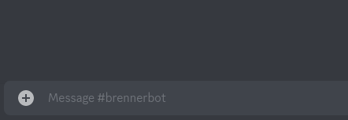
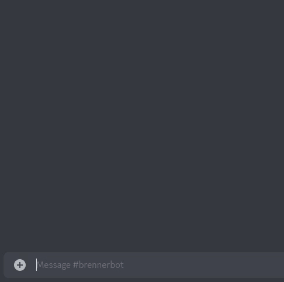

<div align="center">
	<br />
	<p>
		<a></a>
	</p>
</div>

## About
BrennerBot is a python discord bot that comes with a few 😎 cool 😎 features:
- Play music spotify and youtube using [Wavelink](https://github.com/PythonistaGuild/Wavelink)
- Chat and generate images using GPT-3 from [OpenAI](https://openai.com/api/)

It is currently a work in progress, but feel free to use it as you wish. 

If have any questions or need any help you can message me on discord: `k4br`.

Please consider leaving a ⭐ star ⭐ if you find this useful! 

## Features
### GPT-3 & DALL-E Integration
`/chat {prompt}`
<div align="center">
	<br />
	<p>
		<a></a>
	</p>
</div>

`/draw {prompt}`
<div align="center">
	<br />
	<p>
		<a></a>
	</p>
</div>


### Music Player
- Music can be played with the following commands:
  - `?play`, `?pause`, `?resume`, `?skip` & `?stop`
- The bot will join on default, but can be manually moved using `?join` and `?leave`
- All songs are queued by default if a song is currently playing

### Reminders
- Reminders can be set for you and your friends by using the `?remindme` command
- Usage:`?remindme <XdYhZm> <reminder> 	
	- Example: `?remindme 1h30m Remove cake from oven
- You can also include other people in your reminder
	- Example: `?remindme @brennerbot @max 1d5h10m CSGO 3v3
- Reminders are received as a direct message from the bot
 
## Requirements
- [Discord.py](https://github.com/Rapptz/discord.py)
- [Wavelink Server](https://github.com/PythonistaGuild/Wavelink)
- API Keys:
   - [OpenAI](https://openai.com/api/) - for GPT-3 integration ($18 free credit on signup) 🤖
   - [Spotify](https://developer.spotify.com/documentation/web-api/) - To support spotify tracks, albums and playlists in the music player 📻

## Getting Started 

### Cloning the repo
```
git clone git@github.com:br3nr/brennerbot.git
cd brennerbot
python3 -m pip install -r requirements.txt
```

### Adding the API keys & Bot Tokens
Before you can run the program, you need to include your discord bot token (See [Creating your bot](https://discordjs.guide/preparations/setting-up-a-bot-application.html#creating-your-bot) if you do not have this.) 

The bot token is needed in `bot.py`. Replace the line:

```py
client.run(os.environ["DISCORD_TOKEN"])
``` 

with,
```py
client.run("YOUR TOKEN GOES HERE")
```

Spotify integration requires two keys, SPOTIFY_CLIENT_ID and SPOTIFY_CLIENT_SECRET. You can access these by creating a spotify application in the [developer portal](https://developer.spotify.com/dashboard/). These keys need to be set in `music.py`: 

```py
def __init__(self, bot: commands.Bot):
        self.cid = "YOUR CLIENT ID HERE"
        self.csecret = "YOUR CLIENT SECRET HERE"
```

The same goes for the OpenAI API key in `gpt.py`:

```py
def __init__(self, bot: commands.Bot):
        self.bot = bot
        self.model_engine = "text-davinci-002"
        openai.api_key = "YOUR OPEN API KEY HERE"
```

## Running the bot
This bot requires a Wavelink server to be running in the background. This needs to be running alongside the discord bot. Please visit the [Wavelink repo](https://github.com/PythonistaGuild/Wavelink) for more information. 

To launch the server, run the following command:
```
java -jar Lavalink.jar
```

Finally, the bot can be launched in a separate terminal using:
```
python3 bot.py
```
